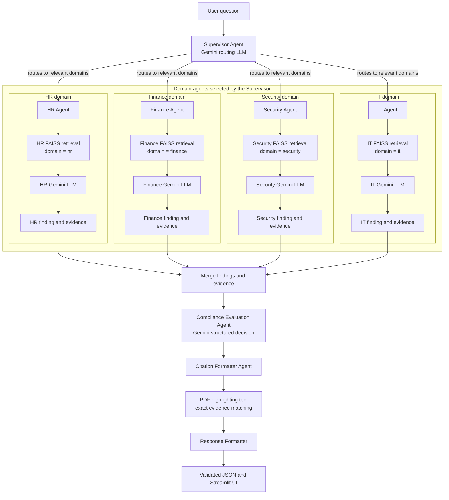

# Enterprise Policy Compliance Assistant

A multi-agent RAG application that evaluates user actions against enterprise policy documents. It retrieves grounded policy evidence, assesses compliance risk, recommends next actions, and shows citations with highlighted source PDFs.

> The included policy PDFs are fictional training documents. Do not treat application output as legal, HR, security, or compliance advice.

## What it does

- Accepts a natural-language policy question or proposed action.
- Uses Gemini to identify the request type and the relevant business domains.
- Searches local FAISS policy embeddings for domain-filtered evidence.
- Produces a structured compliance decision with status, reasoning, risk, approvals, and next actions.
- Cites the policy document, page, and section behind the decision.
- Creates a highlighted copy of the cited PDF, marking the retrieved evidence text.
- Provides a Streamlit interface with agent progress, sample questions, JSON output, and embedded evidence PDFs.

## Architecture



The LangGraph workflow is defined directly in `main.py`:

```text
START → supervisor → selected domain agents → merge → compliance → citations → response → END
```

Domain agents run one at a time only when selected by the Supervisor. This keeps the graph easy to understand while allowing multi-domain questions to use more than one agent.

## Agents and responsibilities

| Agent / node | Purpose |
|---|---|
| **Supervisor / Router** | Uses Gemini structured output to classify intent, request type, and relevant domains. It chooses from Security, HR, Finance, and IT. |
| **Security Agent** | Reviews security, data handling, incidents, passwords, secure transfer, access controls, and device security evidence. |
| **HR Agent** | Reviews leave, remote work, employee conduct, HR requirements, and manager approvals. |
| **Finance Agent** | Reviews expenses, travel, receipts, reimbursement limits, and financial approvals. |
| **IT Agent** | Reviews company devices, approved software, service-desk actions, and technical access requirements. |
| **Compliance Evaluation Agent** | Uses only domain findings and retrieved evidence to return a compliance status, reasoning, risk, policies involved, next action, and approvals required. |
| **Citation Formatter Agent** | Creates traceable citations from retrieval metadata and requests highlighted PDF copies. |
| **Response node** | Assembles the final Pydantic-validated JSON response and readable formatted answer. |

## Tools

### Semantic policy retrieval

`tools/retriever_tool.py` uses:

- **FAISS** for vector similarity search.
- **BAAI/bge-small-en-v1.5** as the embedding model.
- Cosine similarity, implemented by L2-normalizing vectors and using a FAISS inner-product index.
- Domain filtering, so an HR agent sees only chunks tagged `hr`.

The current configuration returns at most **2** chunks per agent and ignores chunks below the configured `MIN_SEMANTIC_SCORE` (currently `0.40`). This number is a semantic similarity score, **not** a probability. Raise it for stricter evidence; lower it if relevant policies are being missed.

### Indexed-domain tool

`tools/policy_domains_tool.py` reads the vector-store metadata and returns available domains with chunk counts. The Supervisor uses this to avoid routing to unavailable domains.

### PDF highlighting tool

`tools/document_tool.py` uses **PyMuPDF** to create a new PDF copy in `data/output/highlighted_evidence/`.

Instead of highlighting a section title, it:

1. Preserves the full retrieved evidence chunk.
2. Normalizes the evidence and source-PDF page words.
3. Matches exact word sequences on the cited page.
4. Highlights only meaningful matches; it avoids marking a short heading alone.

Original policy PDFs are never modified.

## Data validation and JSON output

`models.py` contains the Pydantic models exchanged by the workflow:

- `RoutingDecision`
- `Evidence`
- `DomainFinding`
- `ComplianceDecision`
- `Citation`
- `FinalResponse`

Every agent validates structured LLM output or tool output at the workflow boundary. The final result is emitted as JSON and includes:

```json
{
  "question": "...",
  "routing": { "intent": "...", "agents": ["hr"] },
  "compliance_decision": {
    "status": "Allowed with Conditions",
    "risk": "Medium",
    "reasoning": "...",
    "recommended_next_action": "..."
  },
  "findings": [],
  "citations": [],
  "highlighted_documents": [],
  "formatted_answer": "..."
}
```

## Policy ingestion and vector store

Run `ingest_policies.py` whenever you add, edit, or remove policy documents.

The script:

1. Reads PDFs, Markdown, and text documents from `data/input/policies/`.
2. Extracts page-aware text.
3. Chunks text into roughly 900-character chunks with 150-character overlap.
4. Tags each document with one or more domains.
5. Generates normalized embeddings.
6. Stores vectors in FAISS and source metadata in JSON.

It uses SHA-256 hashes in `data/vector_store/manifest.json` to detect changes:

- New documents are appended to the existing index.
- Changed or removed documents trigger a safe full rebuild.
- Unchanged documents are skipped.

## Project structure

```text
.
├── agents/
│   ├── llm.py                    # Shared Gemini configuration
│   ├── supervisor_agent.py       # Gemini router
│   ├── domain_agents.py          # Reusable Security/HR/Finance/IT agents
│   ├── compliance_agent.py       # Structured compliance decision
│   └── citation_agent.py         # Citation and PDF-highlight coordination
├── tools/
│   ├── retriever_tool.py         # FAISS semantic search
│   ├── policy_domains_tool.py    # Available-domain lookup
│   └── document_tool.py          # Exact evidence highlighting in PDFs
├── data/
│   ├── input/policies/           # Source policy documents
│   ├── vector_store/             # Generated FAISS index and metadata
│   └── output/
│       ├── sample_questions.md   # Streamlit sample-question source
│       └── highlighted_evidence/ # Generated PDFs; ignored by Git
├── ingest_policies.py            # Policy ingestion entry point
├── main.py                       # LangGraph workflow and terminal interface
├── models.py                     # Pydantic contracts
├── streamlit_app.py              # Interactive web interface
├── test_api_key.py               # Gemini API connectivity check
└── requirements.txt
```

## Setup

### 1. Install dependencies with uv

```powershell
uv add faiss-cpu sentence-transformers pymupdf pydantic langchain-google-genai langgraph python-dotenv streamlit
```

The same package list is recorded in `requirements.txt` for Streamlit Community Cloud.

### 2. Configure Gemini

Create a local `.env` file. It is ignored by Git.

```env
GEMINI_API_KEY=your_gemini_api_key
GEMINI_MODEL=gemini-3.1-flash-lite
```

The code also accepts the lowercase `gemini_api_key` name for local compatibility.

### 3. Check the API key

```powershell
uv run test_api_key.py
```

### 4. Build or update the vector store

```powershell
uv run ingest_policies.py
```

### 5. Run the terminal workflow

```powershell
uv run main.py
```

### 6. Run the web application

```powershell
uv run streamlit run streamlit_app.py
```

## Streamlit experience

The web interface includes:

- A question input and compliance-check action.
- A rotating set of six sample questions loaded from `data/output/sample_questions.md`.
- Visible workflow progress while agents run.
- A persistent **Review process** panel after the response is complete.
- Colour-coded compliance status and independent Low/Medium/High risk badges.
- A detailed, scannable answer with emphasized labels.
- Full final JSON in an expander.
- An embedded highlighted policy PDF opened at the first cited page.
- A document picker and download button when multiple source PDFs are cited.

## Deployment notes

For a demo deployment on Streamlit Community Cloud:

1. Push the source PDFs and the prebuilt `data/vector_store/` files to GitHub.
2. In Streamlit Community Cloud, use `streamlit_app.py` as the entry point.
3. Set Python **3.12** in Advanced settings for compatibility with the embedding stack.
4. Add secrets in the Streamlit dashboard, not in Git:

```toml
GEMINI_API_KEY = "your_gemini_api_key"
GEMINI_MODEL = "gemini-3.1-flash-lite"
```

`data/vector_store/` is ignored by default, so a demo deployment may require explicitly adding it after ingestion:

```powershell
git add -f data/vector_store
```

For production, replace the local FAISS files with a persistent shared vector database, add SSO/authorization, audit logging, controlled document upload, and a secure policy-reindexing pipeline.

## Security reminders

- Never commit `.env`, API keys, or real confidential policy documents without approval.
- The Gemini API key belongs in Streamlit Community Cloud Secrets for cloud deployment.
- A semantic similarity score is evidence ranking, not compliance confidence.
- If no suitable evidence is retrieved, the system should return `Insufficient Policy Evidence` rather than infer a rule.

## Sample questions

- Can I paste customer data into a public AI tool?
- I lost my company laptop at the airport. What should I do?
- Can I work from home using my personal laptop?
- How many annual-leave days can I carry into next year?
- Do I need a receipt for a EUR 40 business expense?
